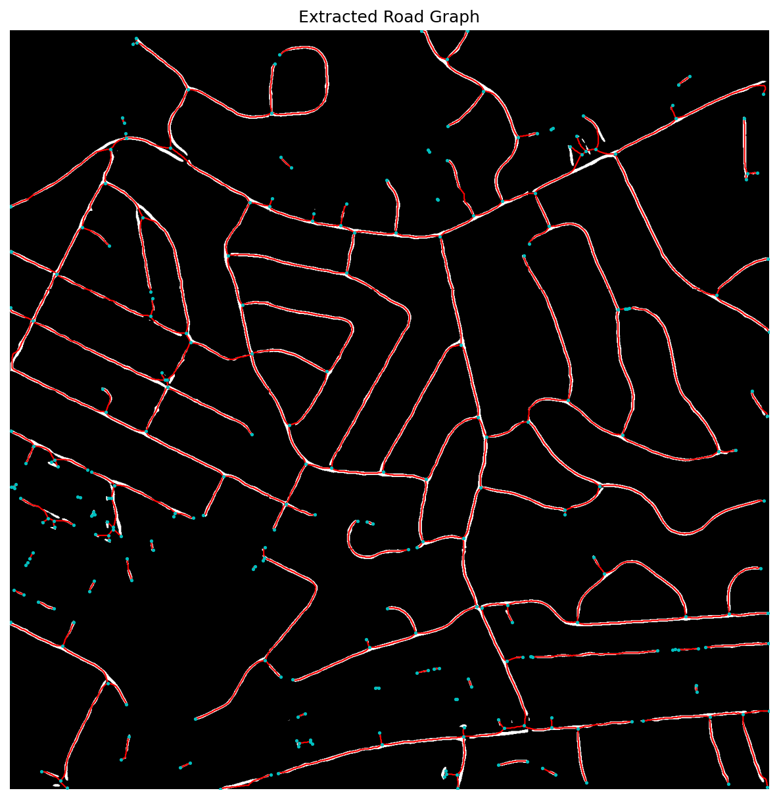

# Satellite Road Detection and Routing System

An end-to-end computer vision pipeline that turns raw satellite imagery into a navigable road network and computes shortest paths across it — from pixels to a routable graph to a rendered route.

Built by a team of 3 in 2026, covering the full pipeline: dataset ingestion, road segmentation model training, mask-to-graph conversion, and Dijkstra-based routing with support for blocked roads.



## How it works

```
Satellite image (.tiff)
        │
        ▼
 [1] Segmentation ── D-LinkNet / U-Net hybrid (PyTorch) run tile-by-tile
        │              → binary road mask
        ▼
 [2] Skeletonization ── morphological closing + skimage skeletonize
        │                → 1px-wide road centerlines
        ▼
 [3] Graph building ── mask/skeleton converted to a weighted NetworkX graph
        │                (nodes = intersections/endpoints, edges = road segments)
        ▼
 [4] Routing ── Dijkstra shortest path between two points, with
                  support for removing "blocked" road segments
        ▼
   Route drawn back onto the satellite image
```

### 1. Segmentation model
[`src/model/architecture.py`](src/model/architecture.py) implements `DL_UNet`, a U-Net-style encoder/decoder with a **D-LinkNet center block**: cascaded dilated convolutions (dilation rates 1/2/4/8, summed as residual connections) at the bottleneck to expand the receptive field so the model can "see" across occlusions like tree shadows without losing spatial resolution.

- Trained on the [Massachusetts Roads Dataset](https://www.cs.toronto.edu/~vmnih/data/) ([`src/downloader.py`](src/downloader.py) fetches it via `kagglehub`)
- Training loop: [`src/model/train.py`](src/model/train.py) — Adam optimizer, `BCEWithLogitsLoss`, mixed-precision (`torch.cuda.amp`), 256×256 random crops via [`src/model/dataset.py`](src/model/dataset.py)
- **Results: Dice 0.629, PR AUC 0.767**

### 2. Tiled inference
Full satellite images (up to 1500×1500) don't fit through the network at once on CPU, so [`src/model/inference.py`](src/model/inference.py) slides a configurable tile window (default 512×512) across the image, predicts each tile independently, pads edge tiles to keep input size constant, and stitches the binary mask back together.

- **Reaches ~5s end-to-end latency on CPU** for a full high-resolution image

### 3. Mask → graph
[`src/processing/skeletonize.py`](src/processing/skeletonize.py) closes small gaps in the predicted mask (morphological closing, tuned for ~15m gaps in the Massachusetts dataset), reduces it to a 1-pixel-wide skeleton (`skimage.morphology.skeletonize`), and builds a `NetworkX` graph of the network using `sknw`, where nodes are intersections/endpoints and edges carry the pixel-path geometry.

### 4. Routing
[`ShowShortestPath.py`](ShowShortestPath.py) converts a skeleton into a weighted graph (using `skan`, with edge weights set to true branch distance so curved roads are costed correctly) and exposes:

- `find_shortest_path(start, end)` — Dijkstra shortest path, injecting the start/end points onto the nearest road edge rather than snapping to existing nodes
- `block_road(barrier_coords)` — removes the graph edge nearest a barrier point, letting the router re-route around closures
- `get_satellite_navigation_map(...)` — runs the whole routing step and draws the resulting path as a red line directly onto the satellite image

## Project structure

```
src/
  downloader.py            Downloads/stages the Massachusetts Roads Dataset
  model/
    architecture.py        DL_UNet (U-Net + D-LinkNet dilated bottleneck)
    dataset.py              PyTorch Dataset for image/mask pairs
    train.py                Training loop
    inference.py            Tiled inference for large images
  processing/
    skeletonize.py           Mask → skeleton → NetworkX graph (sknw)
    graph_builder.py          (see skeletonize.py — mask-to-graph pipeline)
  engine/
    pathfinder.py            (routing logic currently lives in ShowShortestPath.py)
ShowShortestPath.py         Shortest-path solver + barrier handling + visualization
test_inference.py           End-to-end smoke test: load model → predict → visualize
assets/                      Demo satellite image, predicted mask, and graph visualization
```

## Setup

```bash
pip install torch torchvision numpy opencv-python pillow matplotlib \
            scikit-image sknw skan networkx kagglehub
```

Download the training data:

```bash
python -m src.downloader
```

This stages the Massachusetts Roads Dataset under `data/massachusetts_roads/` (via Kaggle — requires Kaggle API credentials configured for `kagglehub`).

## Usage

**Train the segmentation model** (expects data under `training_data/massachusetts_roads/tiff/{train,train_labels}`, saves checkpoints to `data/weights/`):

```bash
cd src/model
python train.py
```

**Run inference on a satellite image and visualize the predicted mask:**

```bash
python test_inference.py
```

Loads `data/weights/unet.pth`, tiles and predicts on `assets/demo_satellite.tiff`, and saves the mask to `assets/demo_output.tiff`.

**Build the road graph and route between two points:**

```python
import cv2
from src.processing.skeletonize import build_graph_from_mask
from ShowShortestPath import get_satellite_navigation_map

mask = cv2.imread("assets/demo_output.tiff", 0)
satellite_img = cv2.imread("assets/demo_satellite.tiff")

output = get_satellite_navigation_map(
    satellite_img,
    skeleton_matrix=mask,   # skeletonized road mask
    start=(y1, x1),
    end=(y2, x2),
    barriers=[],            # optional list of (y, x) points to block
)
cv2.imwrite("route.png", output)
```

## License

MIT — see [LICENSE](LICENSE).
